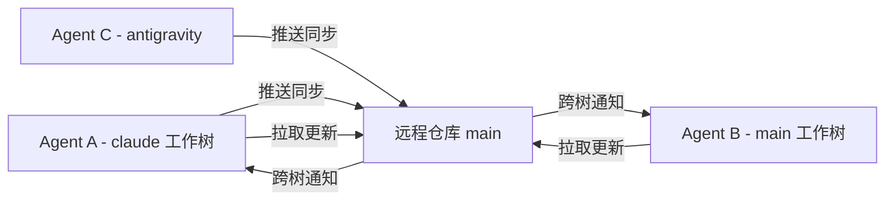

# 🌳 Git Worktree 开发模式指南

这是一个为 Claude Code 用户设计的完整指南，帮助你理解和使用 Git worktree 模式进行多代理并发开发。

## 📋 目录

- [什么是 Git Worktree？](#什么是-git-worktree)
- [为什么使用 Worktree 模式？](#为什么使用-worktree-模式)
- [当前工作树配置](#当前工作树配置)
- [标准术语速查表](#标准术语速查表)
- [日常开发流程](#日常开发流程)
- [同步操作详解](#同步操作详解)
- [常见问题处理](#常见问题处理)
- [代理间协作协议](#代理间协作协议)
- [错误示例与纠正](#错误示例与纠正)

## 什么是 Git Worktree？

Git Worktree 允许你在同一个仓库中创建多个工作目录，每个目录都可以绑定到不同的分支。这意味着：

- 🔄 **并行开发**：多个 Agent 可以同时在不同分支上工作
- 🚫 **避免切换**：无需反复执行 `git checkout`
- 🛡️ **环境隔离**：每个工作树相互独立，不会互相影响
- ⚡ **即时同步**：一个工作树的提交立即对所有工作树可见

## 为什么使用 Worktree 模式？

在 Claude Code 多代理开发场景中，worktree 模式解决了：

1. **分支混乱问题**：避免多代理在不知情的状况下修改同一分支
2. **工作冲突问题**：防止一个代理意外覆盖另一个代理的修改
3. **状态不一致问题**：确保所有代理都能获取最新的代码状态
4. **协同效率问题**：通过标准化流程提高多代理协作效率

## 当前工作树配置

| 工作树路径 | 绑定分支 | 用途 | 状态 |
|------------|----------|------|------|
| `/Users/Jacob/clawd` | main | 主工作空间 | 🟢 活跃 |
| `/Users/Jacob/clawd-antigravity` | antigravity | 特色功能开发 | 🟢 活跃 |
| `/Users/Jacob/clawd-claude` | claude | 当前工作空间 | 🟢 活跃 |
| `/Users/Jacob/clawd-codex` | codex | Codex 相关开发 | 🟢 活跃 |

## 标准术语速查表

| 术语 | 英文 | 用途 | 示例 |
|------|------|------|------|
| **推送同步** | Push-Sync | 向远程分支推送更改 | `git push origin claude:main` |
| **拉取更新** | Pull-Update | 从远程分支获取更新 | `git pull origin main` |
| **跨树通知** | Cross-Tree Notification | 告知其他代理有更新 | "发送跨树通知：已推送同步到 main" |
| **工作树锁定** | Worktree Locking | 当前工作树绑定到特定分支 | "当前工作在 claude 工作树锁定环境" |
| **代理隔离** | Agent Isolation | 多代理在独立环境中开发 | "当前处于代理隔离模式" |

## 日常开发流程

### 🚀 开始开发

1. **确认当前工作树**
   ```bash
   pwd  # 查看当前路径
   git branch --show-current  # 确认当前分支
   ```

2. **检查最新状态**
   ```bash
   git fetch origin
   git status
   ```

### 💻 进行开发

3. **正常编写代码**
   - 创建新文件
   - 修改现有代码
   - 运行测试验证

4. **提交更改**
   ```bash
   git add 文件列表
   git commit -m "类型: 描述更改内容"
   ```

### 🔄 同步到主分支

5. **执行推送同步**
   ```bash
   git push origin 当前分支:main
   # 例如：git push origin claude:main
   ```

6. **发送跨树通知**（口头或系统通知）
   > "已完成推送同步，修改了 XX 功能，请在主工作树执行拉取更新"

## 同步操作详解

### 🔄 推送同步 (Push-Sync)

**适用场景**：当前工作完成，需要合并到主分支

**执行命令**：
```bash
git push origin 源分支:目标分支
```

**示例对话**：
```markdown
当前在 claude 工作树，分支绑定状态：已锁定
执行推送同步操作：git push origin claude:main
推送同步成功，等待跨树通知确认
```

### 📥 拉取更新 (Pull-Update)

**适用场景**：接收到其他代理的跨树通知后

**执行命令**：
```bash
# 切换到目标工作树
cd /Users/Jacob/clawd  # main 工作树路径
git pull origin main
```

**示例对话**：
```markdown
接收到来自 claude 工作树的跨树通知
正在主工作树执行拉取更新：git pull origin main
拉取更新成功，代码已同步
```

### 📡 跨树通知

**通知格式**：
```
跨树通知：推送同步完成
- 来源：[工作树名称] 工作树
- 分支：[源分支] → main
- 内容：[简要描述修改]
- 请在 [目标工作树] 执行拉取更新
- 时间：[时间戳]
```

## 常见问题处理

### ❌ 问题1：尝试切换分支
```bash
$ git checkout main
fatal: 'main' is already checked out at '/Users/Jacob/clawd'
```

🔧 **解决方案**：不要切换分支！使用推送同步模式
```bash
# ✅ 正确做法
$ git push origin claude:main
# 然后在 main 工作树拉取
```

### ❌ 问题2：尝试合并分支
```bash
$ git merge main
error: merge is not possible because you have unmerged files.
```

🔧 **解决方案**：使用工作树隔离模式
```bash
# ✅ 正确做法：推送同步 + 拉取更新
$ git push origin claude:main
cd ../main && git pull origin main
```

### ❌ 问题3：推送冲突
```bash
$ git push origin claude:main
! [rejected]        claude -> main (fetch first)
```

🔧 **解决方案**：
```bash
# 1. 获取最新状态
$ git fetch origin main
# 2. 拉取更新同步当前分支
$ git pull origin claude
# 3. 重新推送同步
$ git push origin claude:main
```

## 代理间协作协议

### 🤝 协作原则

1. **推送后立即通知**：完成推送同步后必须主动告知
2. **明确通知内容**：包括来源、目标、修改内容
3. **确认更新完成**：收到通知后确认已拉取更新
4. **避免同时修改**：协调好各代理的工作内容

### 🔄 标准协作流程



### 📋 协作检查清单

- [ ] 开始工作前：确认当前工作树路径
- [ ] 提交更改后：执行推送同步
- [ ] 推送完成后：发送跨树通知
- [ ] 收到通知时：立即执行拉取更新
- [ ] 完成后：确认所有工作树同步状态

## 错误示例与纠正

### ❌ 错误描述：
```
我想要切换分支，但是报错了
```

### ✅ 正确描述：
```
当前在 claude 工作树，处于工作树锁定状态
需要执行推送同步到 main 分支，而非切换分支
正在执行：git push origin claude:main
```

### ❌ 错误描述：
```
合并分支失败了怎么办？
```

### ✅ 正确描述：
```
尝试执行传统合并操作失败
工作树模式下应使用推送同步流程
解决方案：git push origin claude:main
然后在主工作树执行拉取更新
```

---

## 💡 小贴士

1. **始终确认环境**：使用 `pwd` 和 `git branch --show-current`
2. **使用专业术语**：记住"推送同步"、"拉取更新"、"跨树通知"
3. **明确操作流程**：按照"修改→提交→推送同步→跨树通知"顺序
4. **及时同步状态**：完成操作后立即告知其他代理
5. **记录协作历史**：保留通知记录便于追溯

## 📞 遇到问题？

如果遇到任何工作树模式相关问题：

1. **先自查**：检查当前路径、分支、状态
2. **确认流程**：是否按照标准术语和流程操作
3. **查看日志**：使用 `git log --oneline` 检查提交历史
4. **发送协助请求**：描述当前状态、已执行操作、错误信息

记住：**在 worktree 模式下，推送同步 + 拉取更新 = 完美替代传统合并！** 🎯